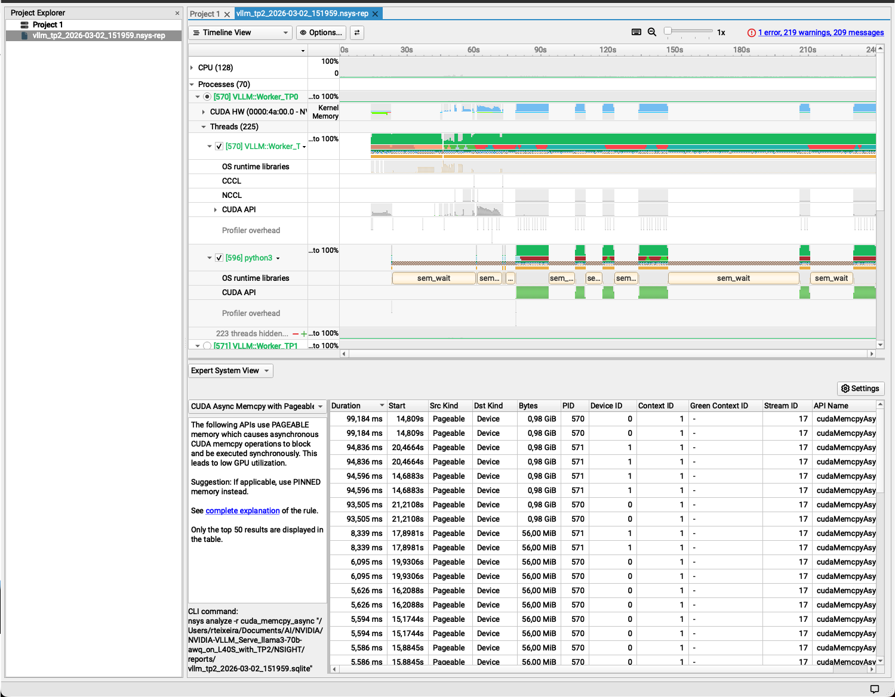
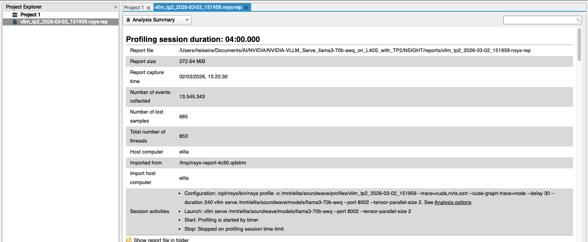
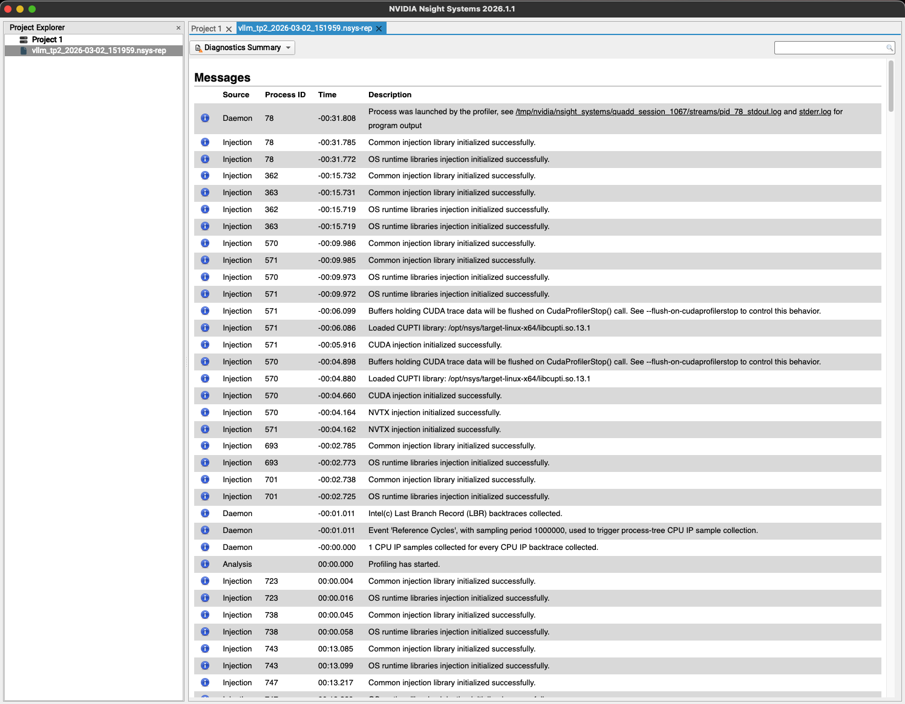
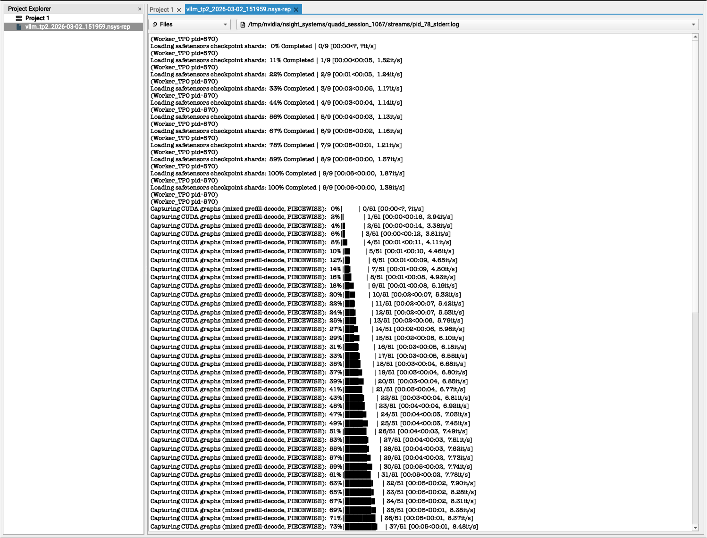
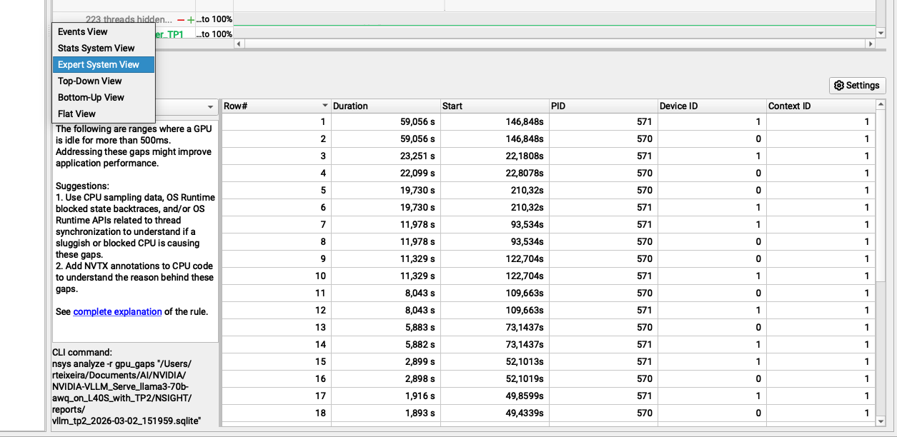
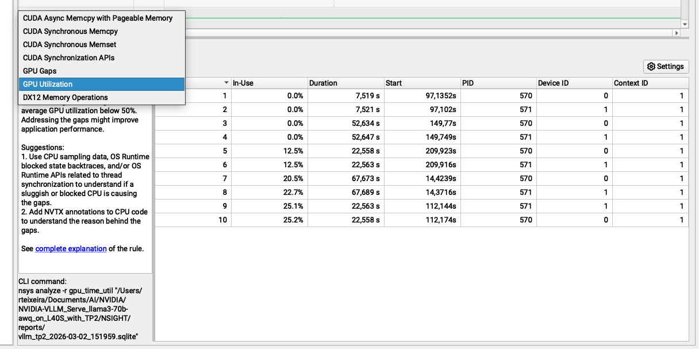

# Nsight Visualization

### Installation MACOS

- reference: https://developer.nvidia.com/nsight-systems  
- It can be installed via, multiple ways, check the latest/simplest macos install below:
  

Note: Check the GTC25: https://resources.nvidia.com/en-us-nsight-developer-tools/gtc25-s72867  

  "This is a must"
  
 ❯ brew install --cask nvidia-nsight-systems
 ```
==> Downloading https://developer.nvidia.com/downloads/assets/tools/secure/nsight-systems/2026_1/NsightSystems-macos-arm64-public-2026.1.1.204-3
Already downloaded: /Users/rteixeira/Library/Caches/Homebrew/downloads/bce6eedd083d2ced3a0657bfd40f6dad4a592341344fb4b6cdd4258d6a60e4c0--NsightSystems-macos-arm64-public-2026.1.1.204-3717666.dmg
==> Installing Cask nvidia-nsight-systems
Warning: Failed setting group "admin" on /private/tmp/homebrew-unpack-20260302-7107-jpx5l3
==> Moving App 'NVIDIA Nsight Systems.app' to '/Applications/NVIDIA Nsight Systems.app'
Password:
🍺  nvidia-nsight-systems was successfully installed!
```
   
---
  
#### NSIGHT APP DashBoard (Offline mode)

 

- Shows the full CPU + GPU timeline (threads, CUDA API calls, GPU kernels, NVTX ranges like NCCL) so you can correlate when work happens and spot idle gaps / lack of overlap between CPU scheduling, comms, and GPU compute.
  
  
 

- High-level “run facts”: CPU/GPU inventory, process summary, and the Nsight Systems options/version used to collect the trace—useful for documenting the exact capture context.
  
    
 

- A quick health check: informational/warning/error messages generated during capture and post-processing (e.g., missing symbols, dropped events, configuration issues).
      
 
      
 
  
- Automated analysis that highlights periods where the GPU had no work queued (“gaps”), which often indicates CPU-bound scheduling, synchronization, or communication stalls rather than raw GPU throughput limits.  
    
 

- A time-based view of how busy the GPU is (utilization/active periods) to confirm whether you’re compute-bound (GPU consistently busy) or latency/coordination-bound (utilization comes in bursts with gaps).
    
